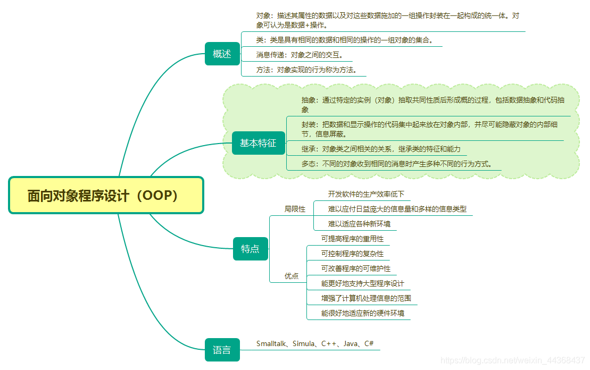

# C++语法



## 三、类和对象

### 3.1 类的构成

> 类声明中的内容包括数据和函数，分别称为数据成员和成员函数。按访问权限划分，数据成员和成员函数可分为共有、保护和私有三种。

```cpp {.line-numbers}
class 类名{
    public:
        公有数据成员；
        公有成员函数；

    protected:
        保护数据成员；
        保护成员函数；

    private:
        私有数据成员；
        私有成员函数；

}；
```

**成绩类**
```cpp {.line-numbers}
class Score{
    public:
        void setScore(int m, int f);
        void showScore();

    private:
        int mid_exam;
        int fin_exam;
};
```

**解释**:

- 对于一个具体的类来讲，类声明格式中三个部分并非一定要全有，但至少要有其中的一个部分。一般情况下，一个类的数据成员应该声明为私有成员，成员函数声明为公有成员。这样，内部的数据整个隐蔽在类中，在类的外部根本无法看到，使数据得到有效的保护，也不会对该类以外的其余部分造成影响，程序之间的相互作用就被降低到最小。
- 类的声明中的关键字private、protected、public可以任意出现。
- 若私有部分处于类的第一部分时，关键字private可以省略。这样，如果一个类体中没有一个访问权限的关键字，则其中的数据成员和成员函数都默认为私有。
- 不能在类声明中给数据成员赋值。


### 3.2 成员函数的定义

**普通成员函数的定义**

> 在类的声明中只给出成员函数的原型，而成员函数的定义写在类的外部。这种成员函数定义的一般形式是:

```cpp {.line-numbers}
返回值类型 类名::成员函数(参数表){函数体}
```

例如：表示分数的类Score可声明如下:

```cpp {.line-numbers}
class Score{
public:
    void setScore(int m, int f);
    void showScore();

private:
    int mid_exam;
    int fin_exam;
};

void Score::setScore(int m, int n){
    mid_exam = m;
    fin_exam = n;
}

void Score::showScore(){
    cout << "期中成绩: " << mid_exam << endl;
	cout << "期末成绩：" << fin_exam << endl;
}
```

**内联成员函数的定义**

- 隐式声明：将成员函数直接定义在类的内部

```cpp {.line-numbers}
class Score{
public:
	inline void setScore(int m, int f) {
        mid_exam = m;
	    fin_exam = f;
    }
	inline void showScore() {
        cout << "期中成绩: " << mid_exam << endl;
	    cout << "期末成绩：" << fin_exam << endl;
    }
private:
	int mid_exam;
	int fin_exam;
};

```

- 显示声明：在类声明只给出函数成员的原型，而将成员函数的定义放在类的外部。

```cpp {.line-numbers}
class Score{
public:
	inline void setScore(int m, int f);
	inline void showScore();
private:
	int mid_exam;
	int fin_exam;
};

inline void Score::setScore(int m, int f) 
{
	mid_exam = m;
	fin_exam = f;
}

inline void Score::showScore()
{
	cout << "期中成绩: " << mid_exam << endl;
	cout << "期末成绩：" << fin_exam << endl;
}

```

**注意**：在类中，使用inline定义内联函数时，必须将类的声明，和内联n成员函数的定义都放在同一个文件(或同一个头文件中)，否则编译时无法进行代码置换。

### 3.3 对象的定义和使用

通常把具有共同属性的行为的事务所构成的集合称为类

类的对象可以看做该类类型的一个实例，定义一个对象和定义一个一般变量相似。

**对象的定义**

- 在声明类的同时，直接定义对象

```cpp {.line-numbers}
class Score{
    public:
        void setScore(int m, int f);
        void showScore();

    private:
        int mid_exam;
        int fin_exam;
}op1, op2;
```

- 声明了类以后，再使用时再定义对象

```cpp {.line-numbers}
Score op1, op2;
```

**对象中成员的访问**

```cpp {.line-numbers}
对象名.数据成员名               op1.showScore();
对象名.成员函数名[参数列表]      op1.setScore(80, 90);
``` 

**说明**：
- 在类的内部所有成员之间都可以通过成员函数直接访问，但类的外部不能访问对象的私有成员。
- 在定义对象时，若定义的是指向此对象的指针变量，则访问此对象的成员时，不能用"."操作符，而应该使用"->"操作符，如下：

```cpp {.line-numbers}
Score op, *sc;
sc = &op;
sc->setScore(90, 90);
op.showScore();
```

**类的作用域和类成员的访问属性**

私有成员只能被类中的成员函数访问，不能在类的外部，通过累的对象进行访问。

一般说，公有成员是类的对外接口，而私有成员是类的内部数据和内部实现，i不希望外界访问。将类的数据成
员划分为不同的访问级别有两个好处：一是信息隐蔽，实现封装，将类的内部数据与内部实现和外部接口分开，这样使该类的外部程序不需要了解类的详细实现；二是保护数据，即将类的重要信息保护起来，以避免其他程序进行不恰当的修改。

**对象赋值语句**

```cpp {.line-numbers}
Score op1, op2;
op1.setScore(99, 100);
op2 = op1;
op2.showScore();
```

### 3.4 构造函数与析构函数

**构造函数**:构造函数时一种特殊的成员函数，它主要用于为对象分配空间，进行初始化。构造函数的名字必须与类名相同 ，而不能由用户任意命名。它可以有任意类型的参数，但不能具有返回值。它不需要用户来调用，而是在建立对象时自动执行。

```cpp {.line-numbers}
class Score{
public:
	Score(int m, int f);  //构造函数
	void setScore(int m, int f);
	void showScore();
private:
	int mid_exam;
	int fin_exam;
};

Score::Score(int m, int f)
{
	mid_exam = m;
	fin_exam = f;
}
```

在建立对象时，采用构造函数给数据成员赋值，通常由以下两种方式
```cpp {.line-numbers}
类名 对象名[{实参表}]
Score op1(99, 100);
op1.showScore();

类名 *指针变量名 = new 类名[{参数表}]
Score *p;
p = new Score(90, 100);
p->showScore();
---------------------------------------
Score *p = new Score(90, 100);
p->showScore();
```
**说明**：
- 构造函数的名字必须与类名相同，否则编译程序将把它当做一般的成员函数来处理
- 构造函数没有返回值类型，在定义构造函数时，是不能说明它的类型的。
- 与普通的成员函数一样，构造函数的函数体可以写在类体内也可以写在类体外。
- 构造函数一般声明为公有成员，但它不需要也不能像其他成员函数那样被显示调用，它是在定义对象的同时被自动调用，而且只执行一次。
- 构造函数不可以带参。

**初始化成员列表**
在声明类时，对数据成员的初始化工作一般在构造函数中用赋值语句进行。此外还可以用成员初始化列表实现对数据成员的初始化。

```cpp {.line-numbers}
类名::构造函数名([参数表])[:{成员初始化列表}] {
    // 构造函数体
}
```
```cpp {.line-numbers}
class A{
private:
    int x;
    int& rx;
    const double pi;

public:
    A(int v) : x(v) , rx(x), pi(3.14){      // 成员初始化列表

    }
    void print()
    {
        cout << "x = " << x << " rx = " << rx << " pi = " << pi << endl;
    }
    
};

/*说明*/
/***
 * 类成员是按照它们在类里被声明的顺序进行初始化的，与它们在成员初始化列表中的顺序无关。
 * 
 * 
 * 
 * 
 * **/
```


**带默认参数的构造函数**
```cpp {.line-numbers}
#include <iostream>
using namespace std;

class Score{
public:
	Score(int m = 0, int f = 0);    //带默认参数的构造函数
	void setScore(int m, int f);
	void showScore();
private:
	int mid_exam;
	int fin_exam;
};

Score::Score(int m, int f) : mid_exam(m), fin_exam(f)
{
	cout << "构造函数使用中..." << endl;
}

void Score::setScore(int m, int f) 
{
	mid_exam = m;
	fin_exam = f;
}

void Score::showScore()
{
	cout << "期中成绩: " << mid_exam << endl;
	cout << "期末成绩：" << fin_exam << endl;
}

int main() 
{
	Score op1(99, 100);
	Score op2(88);
	Score op3;
	op1.showScore();
	op2.showScore();
	op3.showScore();

	return 0;
}

```
**析构函数**

析构函数也是一种特殊的成员函数。它执行与构造函数相反的操作；通常用于撤销对象时的一些清理n任务，如释放分配给对象的i内存空间等。析构函数有以下一些特点：

1. 析构函数与构造函数名字相同，但是他前面必须加一个波浪号(~);
2. 析构函数没有参数和返回值，也不能被重载，因此只有一个。
3. 当撤销对象时，编译系统会自动调用析构函数。

```cpp {.line-numbers}
class Score{
public:

private:

};

/*
**/
```


**默认的构造函数和析构函数**

**构造函数的重载**

**拷贝构造**

**浅拷贝**
浅拷贝，就是由默认的构造函数所实现的数据成员逐一赋值。通常的默认i拷贝构造u函数是能够胜任此工作的，但若类中含有n指针类型的数据，则这种按数据成员逐一赋值的方法会产生错误。
```cpp {.line-numbers}
class Student {
public:

private:
};
```
**深拷贝**

### 3.5 自引用指针this

### 3.6 对象数组与对象指针

### 3.7 string类

### 3.8 向函数传递对象

### 3.9 静态成员
在类的定义中，前面有static说明的成员函数称为静态成员函数。静态成员函数的作用不是对象之间的沟通，而是为了处理静态数据成员。静态成员函数属于整个类，时该类所有对象共享的成员函数，而不属于类中的某个对象。定义静态成员函数的格式如下：

> static 返回类型 静态成员函数名(参数表)；

```cpp {.line-numbers}
/*与静态成员函数类似，调用公有静态成员函数的一般格式有如下几种*/
类名::静态成员函数名（实参表）
对象.静态成员函数名(实参表)
对象指针->静态成员函数名(实参波)
```

一般而言，静态成员函数不访问类中的非静态成员。如确实需要，静态成员函数只能通过对象名(或对象指针、对象引用)访问该对象的非静态成员。


下面对静态成员函数的使用再做几点说明：

1. 一般情况下，静态函数成员主要用来访问静态成员函数。当它与静态数据一起使用时，达到了对同一个类中对象之间共享数据的目的。
2. 私有静态成员函数不能被类外部的函数和对象访问。
3. 使用私有静态成员函数的一个原因是，可以用它建立任何对象之前调用静态成员函数，以处理静态数据成员，这是普通成员函数不能实现的功能。
4. 编译系统将静态成员函数限定为内部连接，也就是说，与现行文件相连接的其他文件中的同名函数不会与该函数发生冲突，维护了该函数使用的安全性，这是使用静态成员函数的另一个原因。
5. 静态成员函数是类的一部分，而不是对象的一部分。如果要在类外调用公有的静态成员函数，使用u如下格式比较好: 类名::静态成员函数名()

```cpp {.line-numbers}
#include <iostream>
using namespace std;

class Score
{
private:
    int mid_exam;
    int fin_exam;
    static int count;           // 静态数据成员，用于统计学生人数
    static float sum;           // 静态数据成员，用于统计期末累加成绩
    static float ave;           // 静态数据成员，用于统计期末平时成绩

public:
    Score(int m, int f);
    ~Score();
    static void show_count_sum_ave();       // 静态成员函数
};

Score::Score(int m, int f)
{
    mid_exam = m;
    fin_exam = f;
    ++count;
    sum += fin_exam;
    ave = sum / count;
}

Score::~Score()
{


}

/*******静态成员初始化**********/

int Score::count = 0;
float Score::sum = 0.0;
float Score::ave = 0.0;

void Score::show_count_sum_ave()
{
    cout << "学生人数: " << count << endl;
	cout << "期末累加成绩: " << sum << endl;
	cout << "期末平均成绩: " << ave << endl;
}

int main()
{
    Score sco[3] = {Score(92, 90), Score(91, 90), Score(90, 90)};
    sco[2].show_count_sum_ave();
    Score::show_count_sum_ave();
    return 0;
}

```


### 3.10 友元

友元函数既可以是不属于任何类的非成员函数，也可以是另一个类的成员函数。友元函数不是当前类的成员函数，但是可以访问该类的所有成员，包括私有成员、保护成员和公有成员。

在类的声明友元函数时，需要在其函数名之前加上关键字friend。此声明可以放在公有部分，也可以放在保护部分和私有部分。友元函数可以定义在类的内部，也可以定义在类的外部

**将非成员函数声明为友元函数**

```cpp {.line-numbers}
#include <iostream>
using namespace std;

class Score{
private:
	int mid_exam;
	int fin_exam;
public:
	Score(int m, int f);
	void showScore();
	friend int getScore(Score &ob);
};

Score::Score(int m, int f)
{
    mid_exam = m;
    fin_exam = f;
}

int getScore(Score &ob)
{
    return (int)(0.3 * ob.mid_exam + 0.7 * ob.fin_exam);
}

int main()
{
    Score score(98, 78);
    cout << "成绩为: " << getScore(score) << endl;
    return 0;
}

```

**说明**:

1. 友元函数虽然可以访问类对象的私有成员，但他毕竟不是成员函数。因此，在类的外部定义友元函数时，不必像成员函数那样，在函数名前面加上"类名"。
2. 因为友元函数不是类的成员，所以它不能直接访问对象的数据成员，也不能通过this指针访问对象的数据成员，它必须通过作为入口参数传递进来的对象名(或对象指针、对象引用)来访问该对象的数据成员。
3. 友元函数提供了不同类的成员函数之间类的成员函数与一般函数之间进行数据共享的机制。尤其当一个函数需要访问多个类时，友元函数非常有用，普通的成员函数只能访问其所属的类，但是多个类的友元函数能够访问相关的所有类的数据类型。

### 3.11 类的组合

### 3.12 共享数据的保护

## 4. 继承与派生

继承可以在已有类的基础上创建新的类，新类可以从一个或多个已有类中继承成员函数和数据成员，而且可以重新定义或加进新的数据和函数，从而形成类的层次或等级。其中类称为基类或父类，在它的基础上建立的新类称为派生类或子类。

**4.1 继承与派生 的概念**

类的继承是新的类从已有类那里得到已有的特性。从另一个角度来看这个问题，从已有类产生新类的过程就是类的派生。类的继承和派生较好地解决了代码重用的问题。

关于基类和派生类的关系，可以表述为 ：派生类是基类的具体化，而基类则是派生类的抽象。

```cpp {.line-numbers}
#include <iostream>
#include <string>

using namespace std;

class Person{
private:
    string name;
    string id_number;
    int age;
public:
    Person(string name1, string id_number1, int age1) {
        name = name1;
        id_number = id_number1;
        age = age1;
    }
    ~Person() {
        
    }
    void show() {
        cout << "姓名: " << name << "  身份证号: " << id_number << " 年龄: " << age << endl;
    }
};

class Student:public Person {
private:
    int creadit;
public:
    Student(string name1, string id_number1, int age1, int creadit1):Person(name1, id_number1, age1) {
        creadit = creadit1;
    }
    ~Student() {

    }
    void show(){
        Person::show();
        cout << "学分： " << creadit << endl;
    }
};

int main(int argc, char ** argv)
{   
    Student stu("白", "1234564651", 12, 123);
    stu.show();

    return 0;
}
```

 派生类对基类成员的访问规则：

 - 内部访问：由派生类中新增的成员函数对基类继承来的成员的访问。
 - 对象访问：在n派生类外部，通过派生类的对象对n从基类继承来的成员的访问。